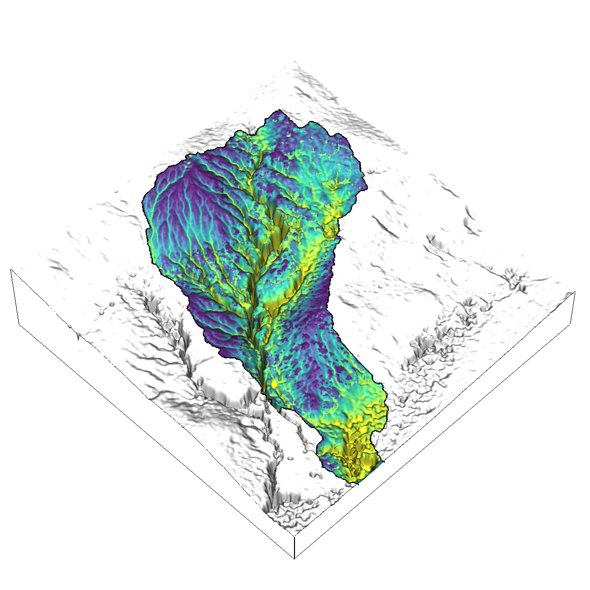
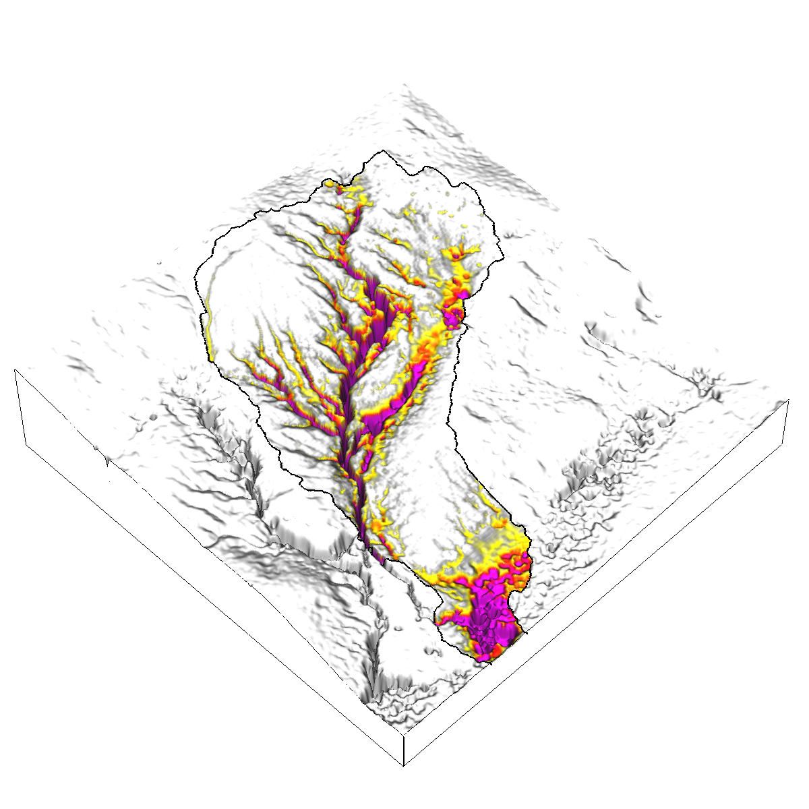

# r.sim.terrain
A short-term  landscape evolution model
that simulates topographic change
for both steady state and dynamic flow regimes
across a range of spatial scales.
This free and open source,
GIS-based landscape evolution model
uses empirical models (RUSLE3D & USPED)
for soil erosion at watershed to regional scales
and a physics-based model (SIMWE)
for shallow overland water flow and soil erosion
at subwatershed scales
to compute short-term topographic change.
This either steady state or dynamic model simulates
how overland sediment mass flows reshape topography
for a range of hydrologic soil erosion regimes
based on topographic, land cover, soil, and rainfall parameters.
As demonstrated by a case study
for Patterson Branch subwatershed
on the Fort Bragg military installation in North Carolina,
*r.sim.terrain* can realistically simulate the development of
fine-scale morphological features including
ephemeral gullies, rills, and hillslopes.
Applications include land management, erosion control,
landscape planning, and landscape restoration.
It is an add-on module for
[GRASS GIS](https://grass.osgeo.org/).

  
  
  
  

Sediment flux (kg*m/s)and net difference (m)
for a steady state, detachment limited SIMWE simulation
of a 120 min event with a rainfall intensity of 25 mm/hr

## Installation
* Launch GRASS GIS
* Install using the GRASS Console / Command Line Interface (CLI) with
`g.extension  extension=r.sim.terrain url=github.com/baharmon/landscape_evolution`
* Launch from the CLI with `r.sim.terrain --ui`

## Documentation
* [Manual page](r.sim.terrain.html)
* Paper: [r.sim.terrain: a dynamic landscape evolution model](tex/landscape_evolution.pdf).
* [Tutorial](tutorial.md)
* [Notebook](https://mybinder.org/v2/gh/baharmon/landscape_evolution/master)

## Sample dataset
Clone or download the
[sample dataset](https://github.com/baharmon/landscape_evolution_dataset)
with a time series of lidar-based digital elevation models
and orthoimagery
for a highly eroded subwatershed of Patterson Branch Creek, Fort Bragg, NC, USA.

## License
GNU General Public License Version 2
