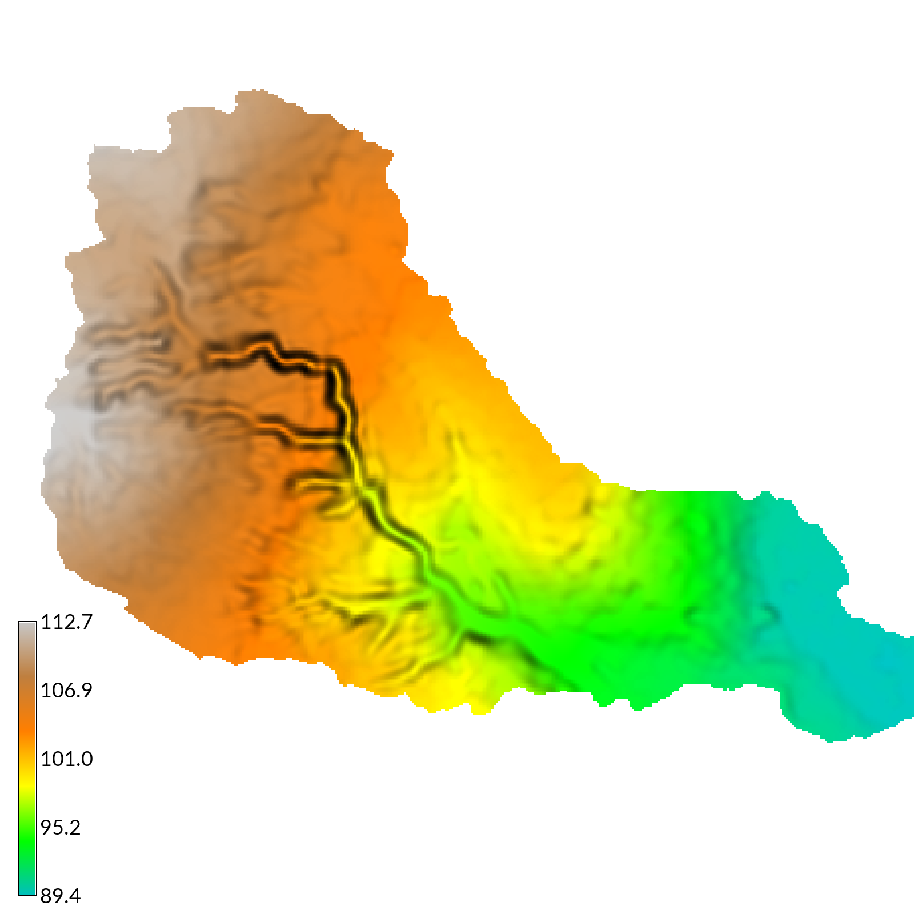

[](https://www.gnu.org/licenses/old-licenses/gpl-2.0.en.html)
[](https://doi.org/10.5281/zenodo.3243699)
<!--[](https://mybinder.org/v2/gh/baharmon/landscape_evolution/master)-->

# r.sim.terrain
A short-term landscape evolution model
that simulates topographic change
for both steady state and dynamic flow regimes
across a range of spatial scales.
This free and open source,
GIS-based landscape evolution model
uses empirical models (RUSLE3D & USPED)
for soil erosion at watershed to regional scales
and a physics-based model (SIMWE)
for shallow overland water flow and soil erosion
at subwatershed scales
to compute short-term topographic change.
This either steady state or dynamic model simulates
how overland sediment mass flows reshape topography
for a range of hydrologic soil erosion regimes
based on topographic, land cover, soil, and rainfall parameters.
As demonstrated by a case study
for Patterson Branch subwatershed
on the Fort Bragg military installation in North Carolina,
*r.sim.terrain* can realistically simulate the development of
fine-scale morphological features including
ephemeral gullies, rills, and hillslopes.
Applications include land management, erosion control,
landscape planning, and landscape restoration.
It is an add-on module for
[GRASS GIS](https://grass.osgeo.org/).

<p align="center">
  
  
</p>
Elevation before and after a steady state SIMWE simulation
of a 120 min event with a rainfall intensity of 50 mm/hr

## Installation
* Launch GRASS GIS
* Install the stable release
using the GRASS Console / Command Line Interface (CLI) with
`g.extension  extension=r.sim.terrain`
* Or install the development release  
using the GRASS Console / Command Line Interface (CLI) with
`g.extension  extension=r.sim.terrain url=github.com/baharmon/landscape_evolution`
* Launch from the CLI with `r.sim.terrain --ui`

## Basic instructions
* Download and extract the [sample dataset](https://github.com/baharmon/landscape_evolution_dataset)
* Launch GRASS GIS,
set the grassdata directory to `landscape_evolution_dataset`,
set the location to `nc_spm_evolution`,
and create a new mapset `rusle`
* Install the stable release
using the GRASS Console / Command Line Interface (CLI) with
`g.extension  extension=r.sim.terrain`
* Set your region to the study area with 1 meter resolution
using the module
[g.region](https://grass.osgeo.org/grass74/manuals/g.region.html):
`g.region region=region res=1`
* Copy `elevation_2016` from the `PERMANENT` mapset to the current mapset with
`g.copy raster=elevation_2016@PERMANENT,elevation_2016`
* Run *r.sim.terrain* with the RUSLE model
for a 120 min event with a rainfall intensity of 50 mm/hr
at a 3 minute interval.
```
r.sim.terrain -f elevation=elevation_2016 runs=event mode=rusle_mode rain_intensity=50.0 rain_duration=120 rain_interval=3 m=0.4 n=1.3
```
* For more detailed instructions see the [Tutorial](tutorial.md)

## Documentation
* Paper: [r.sim.terrain: a dynamic landscape evolution model](tex/landscape_evolution.pdf)
* [Manual page](r.sim.terrain.html)
* [Tutorial](tutorial.md)
* [Notebook](https://mybinder.org/v2/gh/baharmon/landscape_evolution/master)

## Sample dataset
Clone or download the
[sample dataset](https://github.com/baharmon/landscape_evolution_dataset)
with a time series of lidar-based digital elevation models
and orthoimagery
for a highly eroded subwatershed of Patterson Branch Creek, Fort Bragg, NC, USA.

## Replicability
The results in the paper [r.sim.terrain: a dynamic landscape evolution model](tex/landscape_evolution.pdf)
can be replicated by downloading the
[sample dataset](https://github.com/baharmon/landscape_evolution_dataset),
launching GRASS GIS in the sample location,
installing the add-on module,
and then running the Python scripts in the
[scripts](/scripts) directory.
Launch the scripts
[dynamic_simulations.py](/scripts/dynamic_simulations.py)
and [steady_state_simulation.py](/scripts/steady_state_simulation.py)
to run the simulations.
Then launch the script
[render_simulations.py](/scripts/render_simulations.py)
to generate graphics for each simulation.

## License
GNU General Public License Version 2
