# Contents
1. [**Data Preparation**](#data-preparation)
    1. [Lidar reprojection](#lidar-reprojection)
    2. [Lidar binning](#lidar-binning)
    3. [Lidar interpolation](#lidar-interpolation)
    4. [Import orthophotography](#import-orthophotography)
    5. [Unsupervised image classification](#unsupervised-image-classification)
    6. [Parameter derivation](#parameter-derivation)
2. [**Erosion modeling**](#erosion-modeling)
    1. [RULSE](#rusle)
    2. [USPED](#usped)
    3. [SIMWE](#simwe)
      1. [Shallow water flow](#shallow-water-flow)
      2. [Shallow water flow with landcover](#shallow-water-flow-with-landcover)
      3. [Erosion-deposition](#erosion-deposition)
      4. [Sediment flow](#sediment-flow)
      5. [Water flow animation](#water-flow-animation)
3. [**Landscape evolution**](#landscape-evolution)
    1. [RULSE evolution model](#rusle-model)
    2. [USPED evolution model](#usped-model)
    3. [SIMWE evolution model](#simwe-model)
    4. [Parallel processing](#parallel-processing)
    5. [Travel time](#travel-time)
---

# Data preparation

In this section you will learn how to prepare
input data for the landscape evolution model
[r.sim.terrain](https://grass.osgeo.org/grass76/manuals/addons/r.sim.terrain.html)
in [GRASS GIS](https://grass.osgeo.org/).
You will process lidar point clouds,
classify othoimagery,
and then fuse these into a landcover map.

Start GRASS GIS in the `nc_spm_evolution` location
and create a new mapset.
Set your region to our study area with 1 meter resolution
using the module
[g.region](https://grass.osgeo.org/grass76/manuals/g.region.html).
```
g.region region=region res=1
```

## Lidar reprojection
Download the lidar point clouds for this study landscape
from the Open Science Framework
[repository](https://osf.io/r5kbn/).
Extract the zip archive and then
in the GRASS terminal
reproject the lidar data from NAD83 NC Survey Feet (EPSG 6543)
to NC State Plane Meters (EPSG 33580)
using the [liblas](https://www.liblas.org/) library.
```
las2las --a_srs=EPSG:6543 --t_srs=EPSG:3358 -i I-08.las -o ncspm_I-08.las
```

Set your region to our study area with 1 meter resolution
using the module
[g.region](https://grass.osgeo.org/grass76/manuals/g.region.html).
```
g.region n=151030 s=150580 w=597195 e=597645 save=region res=1
```

## Lidar binning
Create a raster map of vegetation by importing the lidar dataset
using binning to convert points into a regular raster grid with the module
[r.in.lidar](https://grass.osgeo.org/grass76/manuals/r.in.lidar.html)
at 2 meter resolution.
Filter the point cloud for low, medium, and high vegetation points
in classes 3, 4, and 5 using the option `class_filter=3,4,5`
and for the first return using the option `return_filter=first`.
Use the `max` statistic.
See the [ASPRS LAS Specification](http://www.asprs.org/wp-content/uploads/2010/12/LAS_1_4_r13.pdf)
for the definitive list of classes.
```
r.in.lidar input=ncspm_I-08.las output=vegetation_2012 method=max resolution=2 class_filter=3,4,5 return_filter=first
r.colors map=vegetation_2012 color=viridis
```

## Lidar interpolation
Import the lidar datasets as vector points using the module
[v.in.lidar](https://grass.osgeo.org/grass76/manuals/v.in.lidar.html).
Limit the import to the current region with flag `-r`.
Filter the point cloud for ground points in class 2
using the option `class_filter=2`.
Interpolate the point cloud
as a bare earth digital elevation model (DEM)
using the regularized spline with tension (RST) method
implemented as the module
[v.surf.rst](https://grass.osgeo.org/grass76/manuals/v.surf.rst.html).
```
v.in.lidar -r -t input=I-08_spm.las output=points_2012 class_filter=2
v.surf.rst input=points_2012 elevation=elevation_2012 tension=10 smooth=1
```

## Import orthophotography
Install the add-on module
[r.in.usgs](https://grass.osgeo.org/grass76/manuals/addons/r.in.usgs.html)
and import the National Agriculture Imagery Program (NAIP)
orthophotograph from 2014 for the study area.
Then composite the red, green, and blue channels
to generate a natural color map using
[r.composite](https://grass.osgeo.org/grass76/manuals/r.composite.html).
```
g.extension extension=r.in.usgs operation=add
r.in.usgs product=naip output_name=imagery output_directory=/usgs
r.composite red=imagery.1 green=imagery.2 blue=imagery.3 output=imagery
```

Alternatively,
download the National Agriculture Imagery Program (NAIP)
orthophotograph from 2014 for the study area
[here](https://datagateway.nrcs.usda.gov/GDGHome_DirectDownLoad.aspx)
and then
import with [r.import](https://grass.osgeo.org/grass76/manuals/r.import.html).
Set the extent to the region.
Then composite the red, green, and blue channels
to generate a natural color map using
[r.composite](https://grass.osgeo.org/grass76/manuals/r.composite.html).
```
r.import input=m_3507963_ne_17_1_20140517.tif output=imagery_2014 title=imagery_2014 resample=nearest resolution=value resolution_value=1 extent=region
r.composite red=imagery_2014.1 green=imagery_2014.2 blue=imagery_2014.3 output=imagery_2014
```

## Unsupervised image classification
Start GRASS GIS in the `nc_spm_evolution` location
and open the `imagery` mapset.
Set your region to our study area with 1 meter resolution
using the module
[g.region](https://grass.osgeo.org/grass76/manuals/g.region.html).
Create a imagery group using the red, green, and blue channels
of the 2014 NAIP orthophotograph with
[i.group](https://grass.osgeo.org/grass76/manuals/i.group.html).
Generate a spectral signatures for landcover based on clustering using
[i.cluster](https://grass.osgeo.org/grass76/manuals/i.cluster.html).
In the settings tab set the initial number of classes to 2,
i.e. bare ground vs vegetation.
Use the spectral signature to classify the landcover
based on maximum-likelihood discriminant analysis
with the module
[i.maxlik](https://grass.osgeo.org/grass76/manuals/i.maxlik.html).

```
g.region region=region res=1
i.group group=imagery subgroup=imagery_2014 input=imagery_2014.1,imagery_2014.2,imagery_2014.3
i.cluster group=imagery subgroup=imagery_2014 signaturefile=signature_imagery_2014 classes=2
i.maxlik group=imagery subgroup=imagery_2014 signaturefile=signature_imagery_2014 output=classification_imagery_2014
```

Use the module [r.recode](https://grass.osgeo.org/grass76/manuals/r.recode.html)
to recode the classified imagery using the rules file
`imagery_to_landcover.txt` stored in the `nc_spm_evolution` location.
This will reassign class 1 to the National Landcover Dataset's (NLCD)
class 71, i.e. *Grassland/Herbaceuous*.
And it will reassign class 2 to NCLD's class 31, i.e. *Barren Land*.
You should have created a map of vegetation
based on classified lidar data called `vegetation_2012`
in the [Lidar](#lidar) tutorial.
Run `g.mapset` and check the `lidar` mapset to access that data.
If you did not create `vegetation_2012`
you can use the copy in the `PERMANENT` mapset.
Use map algebra with
[r.mapcalc](https://grass.osgeo.org/grass76/manuals/r.mapcalc.html)
to combine the lidar based trees and shrub
(reassigned as NLCD class 43, i.e. Mixed Forest)
with the imagery based grass and barren land.
Then assign the NLCD color table from the
`color_landcover.txt` rules file with
[r.color](https://grass.osgeo.org/grass76/manuals/r.colors.html).
Finally assign text labels to the class numbers
based on the rules file `landcover_categories.txt` using
[r.category](https://grass.osgeo.org/grass76/manuals/r.category.html)
```
r.recode input=classification_imagery_2014 output=recode_imagery_2014 rules=imagery_to_landcover.txt
r.mapcalc "landcover = if(isnull(vegetation_2012), recode_imagery_2014, 43)"
r.colors map=landcover rules=color_landcover.txt
r.category map=landcover separator=pipe rules=landcover_categories.txt
```

## Parameter derivation
Use the module
[g.recode](https://grass.osgeo.org/grass76/manuals/r.recode.html).
to derive the k factor, c factor, mannings, and runoff
with the recode tables stored in the `nc_spm_evolution` location.
```
v.to.rast input=soils output=soil_types use=cat memory=3000
r.recode input=soil_types output=soils rules=soil_classification.txt
r.category map=soils separator=pipe rules=soil_categories.txt
r.colors map=soils color=sepia
r.recode input=soils output=k_factor rules=soil_to_kfactor.txt
r.colors map=k_factor color=sepia
g.remove -f type=raster name=soil_types
r.recode input=landcover output=c_factor rules=landcover_to_cfactor.txt
r.colors map=c_factor color=sepia
r.recode input=landcover output=mannings rules=landcover_to_mannings.txt
r.colors map=mannings color=sepia
r.recode input=landcover output=runoff rules=landcover_to_runoff.txt
r.colors map=runoff color=water
```

# Erosion modeling
In this section you will learn about
the RUSLE, USPED, and SIMWE erosion models
in [GRASS GIS](https://grass.osgeo.org/).


Start GRASS GIS in the `nc_spm_evolution` location
and create an `erosion` mapset.

Set your region to our study area with 1 meter resolution
using the module
[g.region](https://grass.osgeo.org/grass76/manuals/g.region.html).
Optionally set the watershed as a mask using the module
[r.mask](https://grass.osgeo.org/grass76/manuals/r.mask.html).
```
g.region region=region res=1
r.mask vector=watershed
```

---

## RUSLE
The **Revised Universal Soil Loss Equation for Complex Terrain (RUSLE3D)**
is an empirical equation for computing erosion
in a detachment-capacity limited soil erosion regime
for watersheds with complex topography ([Mitasova 1996](https://doi.org/10.1080/02693799608902101)).
It is based on the Universal Soil Loss Equation (USLE),
an empirical equation for estimating the average
sheet and rill soil erosion from rainfall and runoff
on agricultural fields and rangelands with simple topography.
It models erosion dominated regimes without deposition
in which sediment transport capacity
is uniformly greater than detachment capacity.
As an empirical equation the predicted soil loss
is spatially and temporally averaged.
In USLE soil loss per unit area is determined by
an erosivity factor **R**,
a soil erodibility factor **K**,
a slope length factor **L**,
a slope steepness factor **S**,
a cover management factor **C**,
and a prevention measures factor **P**.
These factors are empirical constants derived
from an extensive collection of measurements
on 22.1m standard plots with an average slope of 0.09 degrees.  
RUSLE3D was designed to account for more complex, 3D topography
with converging and diverging flows.
In RUSLE3D the topographic potential for erosion at any given point
is represented by a 3D topographic factor **LS3D**,
which is a function of the upslope contributing area
(i.e. the flow accumulation)
and the angle of the slope.
Sediment flow is approximated with the following equation:
```
E = R * K * LS3D * C * P

where:

E is the average annual soil loss
R is an erosivity factor
K is a soil erodibility factor
LS3D is a dimensionless topographic (length-slope) factor
C is a dimensionless land cover factor
P is a dimensionless prevention measures factor
```

---

**LS3D Factor**
The dimensionless 3D topographic factor LS3D
is a function of
the flow accumulation,
representing the upslope contributing area,
and the slope.
The empirical coefficients *m* and *n*
for the upslope contributing area
and the slope
can range from `0.2` to `0.6`
and `1.0` to `1.3` respectively
with low values representing dominant sheet flow
and high values representing dominant rill flow.
For the study landscape set `m=0.4` and `n=1.3`.
The equation for computing the LS3D-factor is:
```
LS_3D(x,y) = (m+1.0) * (a(x,y) * a_0^-1)^m * (sin(beta) * beta_0^-1)^n

where:

LS_3D is the dimensionless topographic (length-slope) factor
a is flow accumulation (m)
a_0 is the length of the standard USLE plot (22.1 m)
beta is the slope angle (degrees)
m is an empirical coefficient
n is an empirical coefficient
beta_0 is the slope of the standard USLE plot (5.14 degrees)
```

Compute the angle of the slope with the module
[r.slope.aspect](https://grass.osgeo.org/grass76/manuals/r.slope.aspect.html).
Then grow border to fix edge effects of moving window computations
with the module
[r.grow.distance](https://grass.osgeo.org/grass76/manuals/r.grow.distance.html)
and the raster calculator
[r.mapcalc](https://grass.osgeo.org/grass76/manuals/r.mapcalc.html).
Remove the temporary map generated by r.grow.distance with
[g.remove](https://grass.osgeo.org/grass76/manuals/g.remove).
Compute flow accumulation with
[r.watershed](https://grass.osgeo.org/grass76/manuals/r.watershed)
with the `a` flag for positive flow accumulation.
Finally compute the dimensionless 3D topographic factor LS3D
with the raster calculator
[r.mapcalc](https://grass.osgeo.org/grass76/manuals/r.mapcalc.html)
as a function of slope and flow accumulation.
Then use the module
[r.colors](https://grass.osgeo.org/grass76/manuals/r.colors.html)
to assign a sequential, perceptually uniform color table such as viridis
with either histogram equalization or logarithmic scaling
with `e` or `g` flag.
```
r.slope.aspect elevation=elevation_2016 slope=slope_2016
r.grow.distance input=slope_2016 value=grow_slope
r.mapcalc "slope_2016 = grow_slope" --overwrite
g.remove -f type=raster name=grow_slope
r.watershed elevation=elevation_2016 accumulation=accumulation_2016 -a
r.mapcalc "ls_factor=(0.4+1.0)*((accumulation_2016/22.1)^0.4)*((sin(slope_2016)/5.14)^1.3)"
r.colors map=ls_factor color=viridis -e
```

<p align="center">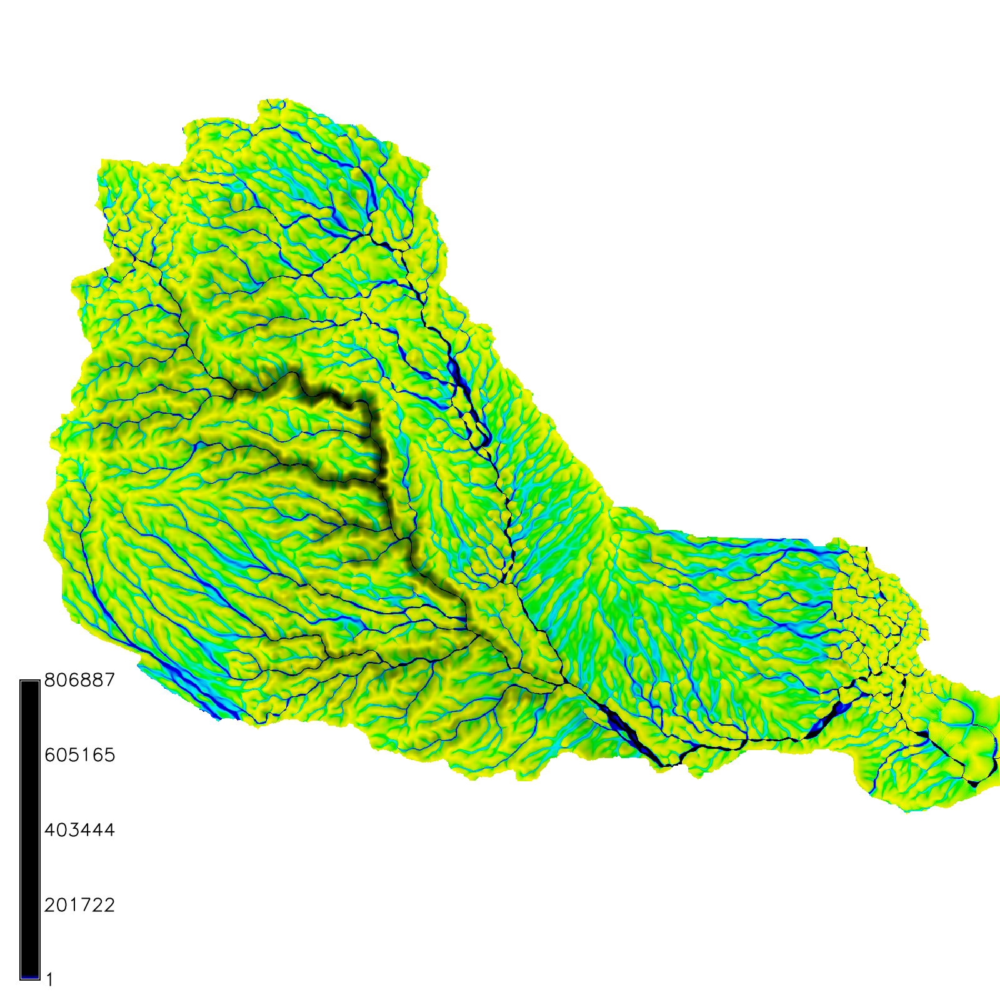</p>

**Flow accumulation**

<p align="center">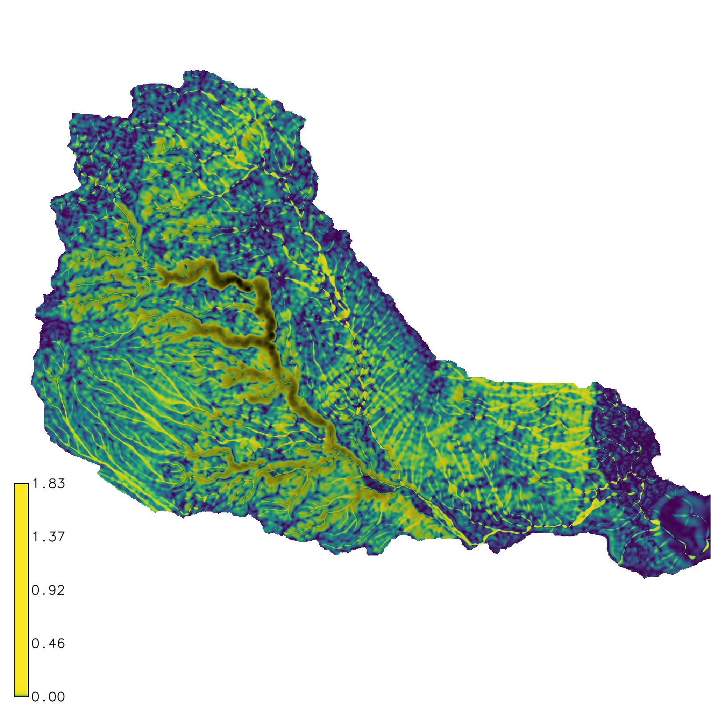</p>

**LS3D factor**

---

**Sediment flow**
The R-factor for our study landscape in Fort Bragg will be 310
([Fogleman 2009](http://www.geomodeler.com/Documents/bragg_Main_optimized.pdf)
and [Renard et al. 1997](https://www.ars.usda.gov/ARSUserFiles/64080530/rusle/ah_703.pdf)).
Use the raster calculator
[r.mapcalc](https://grass.osgeo.org/grass76/manuals/r.mapcalc.html)
to create a raster named `r_factor`
with a constant floating point value of 310.0.
The K-factor is derived from the soil map
and the C-factor is derived from the landcover map.
Do not use a P-factor for the study landscape.
Compute flow using the equation `E = R * K * LS3D * C` without the P-factor.
Then convert sediment flow from tons/ha to kg/ms using the equation
`E = E * ton_to_kg / ha_to_m^2`.
Finally use the module
[r.colors](https://grass.osgeo.org/grass76/manuals/r.colors.html)
to set the viridis color table
with the `e` flag for histogram equalization..

```
r.mapcalc "r_factor=310.0"
r.mapcalc "sediment_flow_2016=r_factor*k_factor*ls_factor*c_factor"
r.mapcalc "converted_flow=sediment_flow_2016*1000./10000."
g.rename raster=converted_flow,sediment_flow_2016
r.colors map=sediment_flow color=viridis -e
g.remove -f type=raster name=r_factor
```

<p align="center">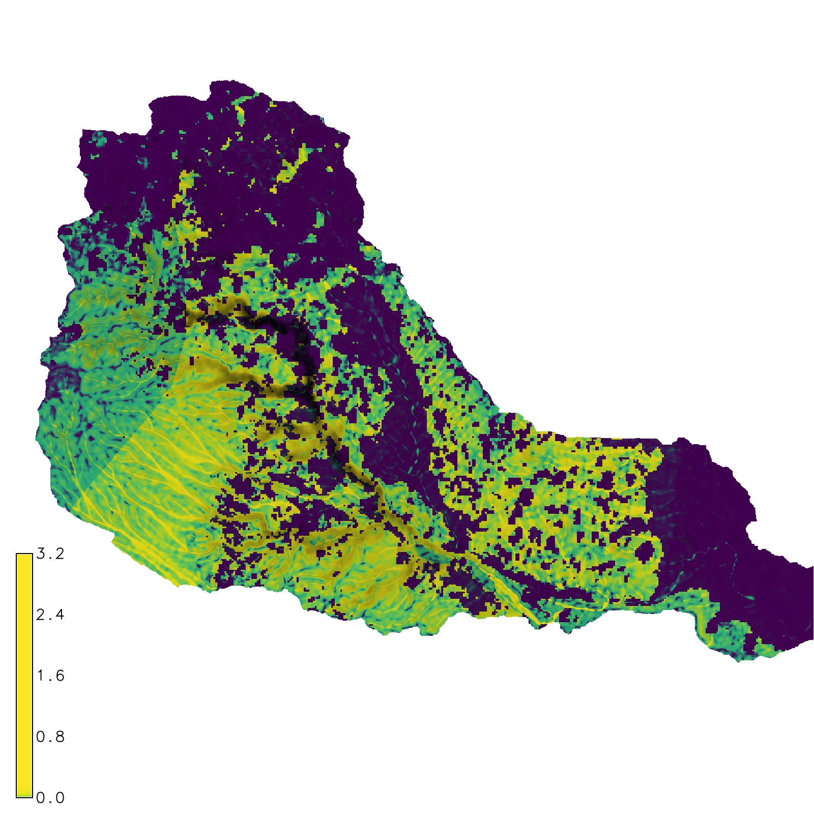</p>

**Sediment flow**

---

**References**
* Fogleman, Brent D. 2009. “Erosion Modeling: Use of Multiple-Return and Bare-Earth LIDAR Data to Identify Bare Areas Susceptible to Erosion MacRidge, Training Area J, Fort Bragg, NC.” http://www.geomodeler.com/Documents/bragg_Main_optimized.pdf.
* Mitasova, Helena, Jaroslav Hofierka, Maros Zlocha, and Louis R. Iverson. 1996. “Modelling Topographic Potential for Erosion and Deposition Using GIS.” International Journal of Geographical Information Science 10 (5): 629–41. https://doi.org/10.1080/02693799608902101.
* Renard, K. G., G. R. Foster, G. A. Weesies, D. K. McCool, and D. C. Yoder. 1997. “Predicting Soil Erosion by Water: A Guide to Conservation Planning with the Revised Universal Soil Loss Equation (RUSLE).” Washington, DC. https://www.ars.usda.gov/ARSUserFiles/64080530/rusle/ah_703.pdf.

---

## USPED
*Under development*

---

## SIMWE
The processed based Simulation of Water Erosion (SIMWE) model
simulates overland hydrologic and sediment flows using a path sampling method.

**References**
* Mitasova, H, M. Barton, I. Ullah, J. Hofierka, and R.S. Harmon. 2013. “3.9 GIS-Based Soil Erosion Modeling.” In Treatise on Geomorphology, 228–58. https://doi.org/10.1016/B978-0-12-374739-6.00052-X.

---

### Shallow water flow
Compute the partial derivatives of the topography using the module
[r.slope.aspect](https://grass.osgeo.org/grass76/manuals/r.slope.aspect.html).
```
r.slope.aspect elevation=elevation_2016 dx=dx dy=dy
```

Simulate shallow overland water flow with
[r.sim.water](https://grass.osgeo.org/grass76/manuals/r.sim.water.html).
for a 10 minute rain event
with a rainfall intensity of 50 mm/hr.
Walkers are the simulated particles of water in the computation.
Increasing the number of walkers reduces errors,
but increases computation time.
Start with a relatively low number of walkers like 10,000
and increase the number to 1,000,000 for your final simulation.
```
r.sim.water elevation=elevation_2016 dx=dx dy=dy rain_value=50.0 depth=depth nwalkers=10000 niterations=10
```

To see only the concentrated water flow
hide the cells with water depth less than value like `0.03` meters
by either
double clicking on the `depth` map in the layer manager
and setting the list of values to display to `100-0.03`
or running the command:
```
d.rast map=depth values=100-0.03
```
Experiment to find the right minimum value.

In the layer manager move the vector contour map above the depth map
and move the raster elevation or the shaded relief map below the depth map
to better visualize the relationship between topography and water.

Display the legend for the water depth map with either the
`Add raster legend` button
or
the command [d.legend](https://grass.osgeo.org/grass76/manuals/d.legend.html).
Optionally use the range parameter set to `range=100-0.03`
to show only the concentrated flow values.

---

## Shallow water flow with landcover
The first run of the simulation assumed constant landcover
with no infiltration and a constant surface roughness
with a default mannings n value of 0.1.
To study the landcover for our region
add the latest orthophotograph `naip_2014` and
the landcover, mannings, and infiltration maps
to your map display.
Display their legends with either the
`Add raster legend` button
or
the command [d.legend](https://grass.osgeo.org/grass76/manuals/d.legend.html).
Use the `-n` flag to hide categories
that are not represented in the data.
See the [Image classification](#image-classification) section
to learn how to derive these maps from orthophotography.

Now simulate overland water flow with
spatially variable surface roughness and infiltration.
Set `man=mannings` and `infil=infiltration`.
Make sure to set the `--overwrite` flag
because you are rerunning the simulation.
```
r.sim.water elevation=elevation_2016 dx=dx dy=dy rain_value=50.0 man=mannings infil=infiltration depth=depth_2016 nwalkers=10000 niterations=10 --overwrite
```

<p align="center">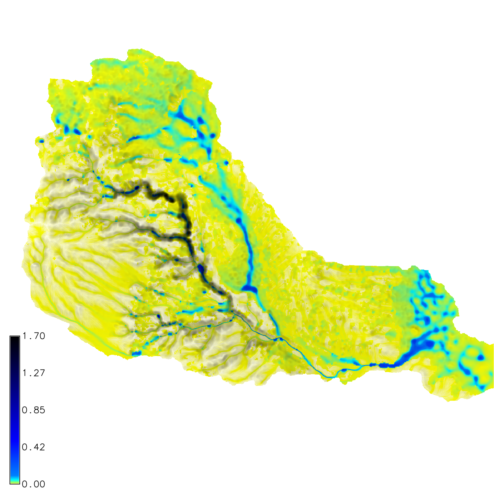</p>

**Water depth**

---

## Erosion-deposition
To simulate erosion-deposition you first need to compute
the detachment coefficient, transport coefficient, and shear stress.
Use map algebra with
[r.mapcalc](https://grass.osgeo.org/grass76/manuals/r.mapcalc.html)
to create new maps with constant values for these parameters.
```
r.mapcalc "detachment = 0.001"
r.mapcalc "transport = 0.001"
r.mapcalc "shear_stress = 0.0"
```

Simulate net erosion-deposition (kg/m^2^s) with
[r.sim.sediment](https://grass.osgeo.org/grass76/manuals/r.sim.sediment.html).
```
r.sim.sediment elevation=elevation_2016 water_depth=depth_2016 dx=dx dy=dy detachment_coeff=detachment transport_coeff=transport shear_stress=shear_stress man=mannings erosion_deposition=erosion_deposition_2016 nwalkers=10000
```
Display the legend for the erosion-deposition map with either the
`Add raster legend` button
or
the command [d.legend](https://grass.osgeo.org/grass76/manuals/d.legend.html).

<p align="center">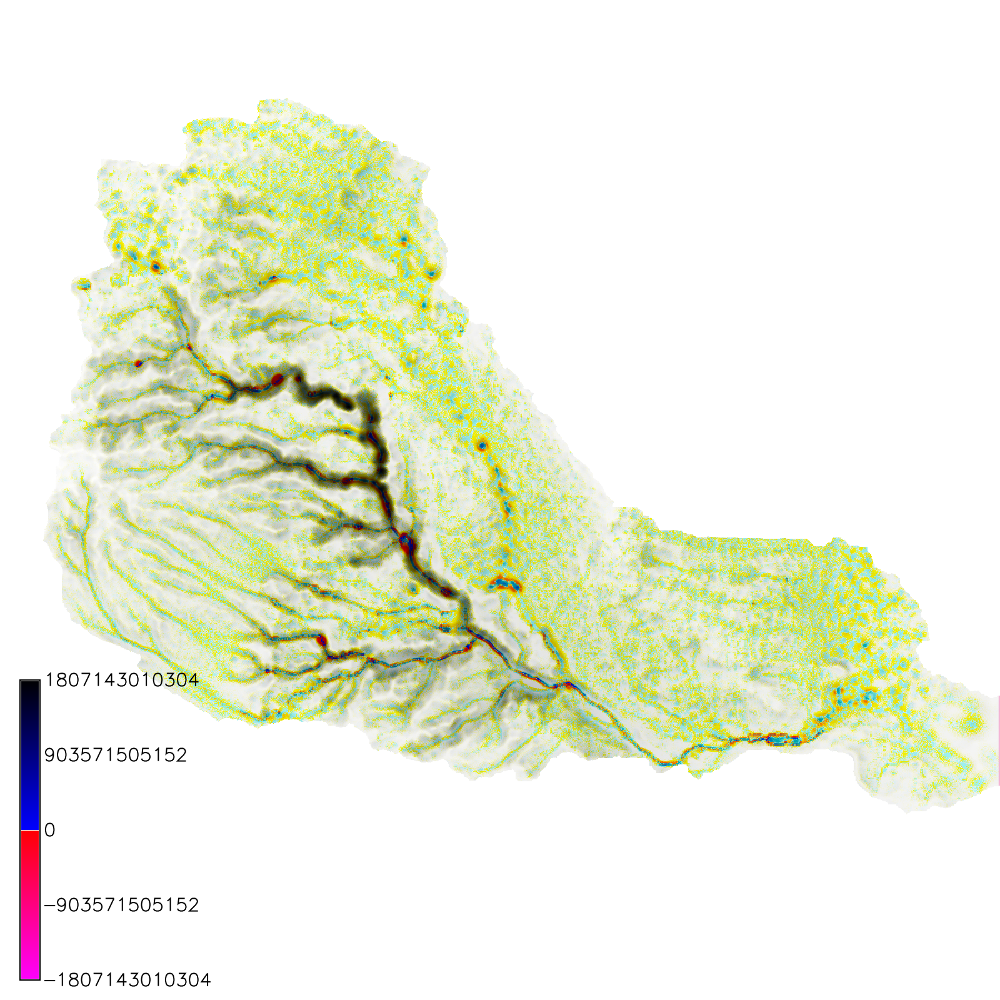</p>

**Erosion deposition**

---

## Sediment flow
In a detachment limited soil erosion regime
water can transport an infinite amount of sediment.
Therefore there is no deposition, only erosion.
In this regime erosion is only limited
by the water flow's capacity to detach sediment.

Overwrite the detachment and transport coefficients
with [r.mapcalc](https://grass.osgeo.org/grass76/manuals/r.mapcalc.html)
```
r.mapcalc "detachment = 0.0001" --overwrite
r.mapcalc "transport = 0.01" --overwrite
```

Simulate sediment flow (kg/ms)
in a detachment limited soil erosion regime with
[r.sim.sediment](https://grass.osgeo.org/grass76/manuals/r.sim.sediment.html).
```
r.sim.sediment elevation=elevation_2016 water_depth=depth_2016 dx=dx dy=dy detachment_coeff=detachment transport_coeff=transport shear_stress=shear_stress man=mannings sediment_flux=sediment_flux_2016 nwalkers=10000
```

<p align="center">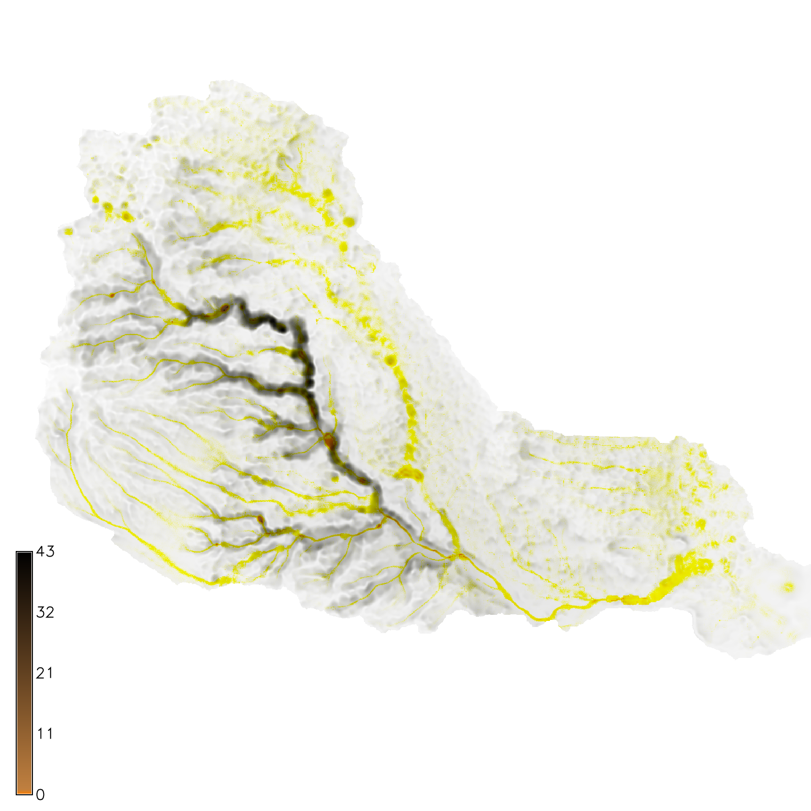</p>

**Sediment flux**

---

## Water flow animation
To create a water flow animation first run the module
[r.sim.water](https://grass.osgeo.org/grass76/manuals/r.sim.water.html)
with the parameter `output_step=1` and the flag `-t` to
create a time series of water depth rasters.
With these settings this will output a water depth raster map
for each minute of the simulation labelled
`depth.01` through `depth.10`.
```
r.sim.water elevation=elevation_2016 dx=dx dy=dy rain_value=50.0 man=mannings infil=infiltration depth=depth nwalkers=10000 niterations=10 output_step=1 -t
```

List this time series of rasters with the module
[g.list](https://grass.osgeo.org/grass76/manuals/g.list.html).
Use the wildcard notation `*` to list all raster maps
with `depth.` in their names.
Use the flag `-m` to include the mapset names in the output.
Copy the list of maps from the output console.
```
g.list type=raster pattern=depth.* separator=comma -m
```

Launch the animation tool
[g.gui.animation](https://grass.osgeo.org/grass76/manuals/g.gui.animation.html)
and paste the list of depth maps into the raster parameter.
```
g.gui.animation raster=depth.01,depth.02,depth.03,depth.04,depth.05,depth.06,depth.07,depth.08,depth.09,depth.10
```

<p align="center">
  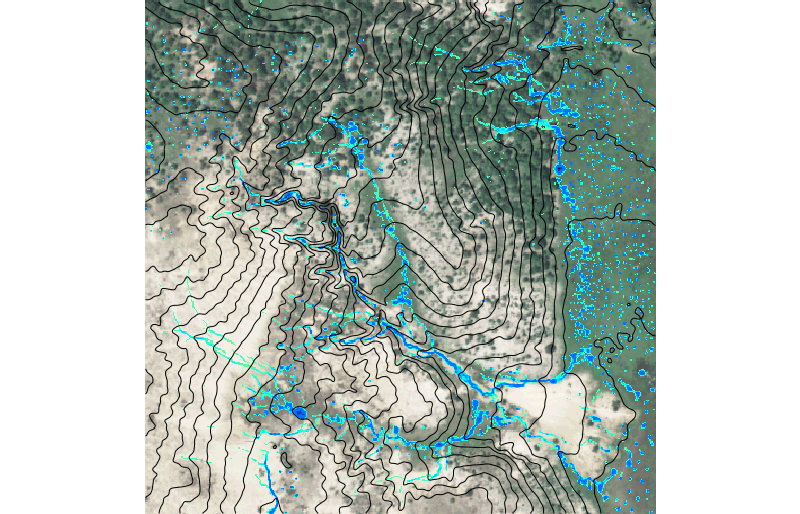
  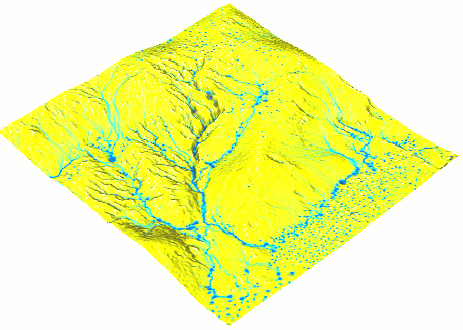
</p>

---

# Landscape evolution

In this section you will learn about
the *r.sim.terrain* landscape evolution model
for [GRASS GIS](https://grass.osgeo.org/).
It uses the RUSLE3D, USPED, and SIMWE erosion models
to simulate short-term topographic change
caused by shallow, overland water and sediment flows.

Start GRASS GIS in the `nc_spm_evolution` location
and select the `PERMANENT` mapset.
Install the add-on module *r.sim.terrain*
with [g.extension](https://grass.osgeo.org/grass76/manuals/g.extension.html)
using the url for this repository.
Launch from the Command Line Interface (CLI) with the `ui` flag.
To install the stable release from the GRASS GIS add-ons repository use:
```
g.extension extension=r.sim.terrain
r.sim.terrain --ui
```
To install the development release from this GitHub repository use:
```
g.extension extension=r.sim.terrain url=github.com/baharmon/landscape_evolution
r.sim.terrain --ui
```

---

## RULSE evolution model
Create a new mapset called `rusle` with the module
[g.mapset](https://grass.osgeo.org/grass76/manuals/g.mapset.html).
```
g.mapset -c mapset=rusle location=nc_spm_evolution
```

Set your region to the study area with 1 meter resolution
using the module
[g.region](https://grass.osgeo.org/grass76/manuals/g.region.html).
Optionally set the watershed as a mask using the module
[r.mask](https://grass.osgeo.org/grass76/manuals/r.mask.html).
Copy `elevation_2016` from the `PERMANENT` mapset to the current mapset
using the module
[g.copy](https://grass.osgeo.org/grass76/manuals/g.copy.html).
The input elevation map must be in the current mapset
so that it can be registered in the temporal datasbase.
```
g.region region=region res=1
r.mask vector=watershed
g.copy raster=elevation_2016@PERMANENT,elevation_2016
```

Run *r.sim.terrain* with the RUSLE model
for a 120 min event with a rainfall intensity of 50 mm/hr
at a 3 minute interval.
The interval should be set to the travel time it takes a
particle of water to cross the region.
To calculate the travel time see section [Travel time](#travel-time).
The empirical coefficients m and n
for the upslope contributing area and the slope can range
from 0.2 to 0.6 and 1.0 to 1.3 respectively
with low values representing dominant sheet flow
and high values representing dominant rill flow.
Optionally use the `-f` flag to fill depressions
in order to reduce the effect of positive feedback loops.
This simulation may take approximately 2 minutes to run.
```
r.sim.terrain -f elevation=elevation_2016 runs=event mode=rusle_mode rain_intensity=50.0 rain_duration=120 rain_interval=3 m=0.4 n=1.3
```

To simulate landscape evolution using RUSLE with
spatially variable landcover and soil erodibility factors
use `c_factor` and `k_factor` raster maps.
Rerun the model with the `--overwrite` flag.
```
r.sim.terrain -f elevation=elevation_2016 runs=event mode=rusle_mode \
rain_intensity=50.0 rain_duration=120 rain_interval=3 m=0.4 n=1.3 \
c_factor=c_factor k_factor=k_factor fluxmax=0.25 grav_diffusion=0.05 --overwrite
```

Display the results with the raster map `net_difference` and a raster legend.
```
d.rast map=net_difference
d.legend raster=net_difference range=-2,0
```

<p align="center">
  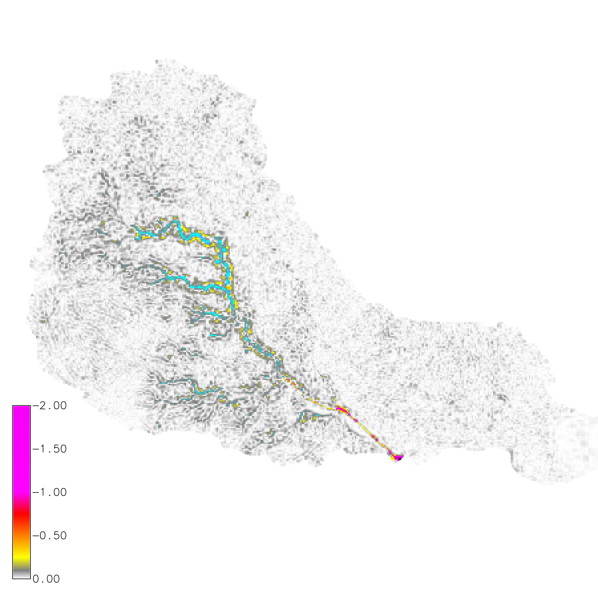
  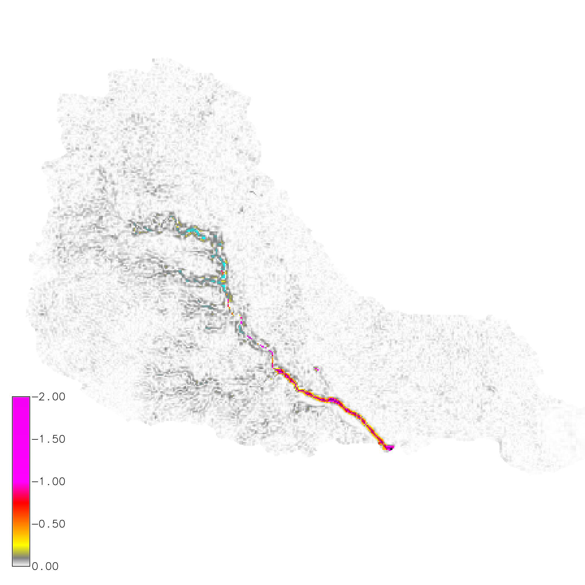
</p>
Net differences (m) for dynamic RUSLE simulations with
**(a)** constant versus **(b)** spatially variable
landcover and soil erodibility factors.
Both were simulated for a 120 min event
with a rainfall intensity of 50 mm/hr
at 3 minute interval at 1 meter resolution.

---

## USPED evolution model
Create a new mapset called `usped` with the module
[g.mapset](https://grass.osgeo.org/grass76/manuals/g.mapset.html).
```
g.mapset -c mapset=usped location=nc_spm_evolution
```

Set your region to the study area with 1 meter resolution
using the module
[g.region](https://grass.osgeo.org/grass76/manuals/g.region.html).
Optionally set the watershed as a mask using the module
[r.mask](https://grass.osgeo.org/grass76/manuals/r.mask.html).
Copy `elevation_2016` from the `PERMANENT` mapset to the current mapset
using the module
[g.copy](https://grass.osgeo.org/grass76/manuals/g.copy.html).
The input elevation map must be in the current mapset
so that it can be registered in the temporal datasbase.
```
g.region region=region res=1
r.mask vector=watershed
g.copy raster=elevation_2016@PERMANENT,elevation_2016
```

Run *r.sim.terrain* with the USPED model
for a 120 min event with a rainfall intensity of 50 mm/hr
at a 3 minute interval.
Set the empirical coefficients m and n
for the upslope contributing area and the slope to
1.5 and 1.2 respectively.
Optionally use the `-f` flag to fill depressions
in order to reduce the effect of positive feedback loops.
This simulation may take approximately 3 minutes to run.
```
r.sim.terrain -f elevation=elevation_2016 runs=event mode=usped_mode rain_intensity=50.0 rain_duration=120 rain_interval=3 m=1.5 n=1.2
```

To simulate landscape evolution using RUSLE with
spatially variable landcover and soil erodibility factors
use `c_factor` and `k_factor` raster maps.
Rerun the model with the `--overwrite` flag.
```
r.sim.terrain -f elevation=elevation_2016 runs=event mode=usped_mode rain_intensity=50.0 rain_duration=120 rain_interval=3 m=1.5 n=1.2 c_factor=c_factor k_factor=k_factor erdepmin=-0.25 erdepmax=0.25 density_value=1.6 grav_diffusion=0.05 --overwrite
```

Display the results with the raster map `net_difference` and a raster legend.
```
d.rast map=net_difference
d.legend raster=net_difference range=-2,2
```

<p align="center">
  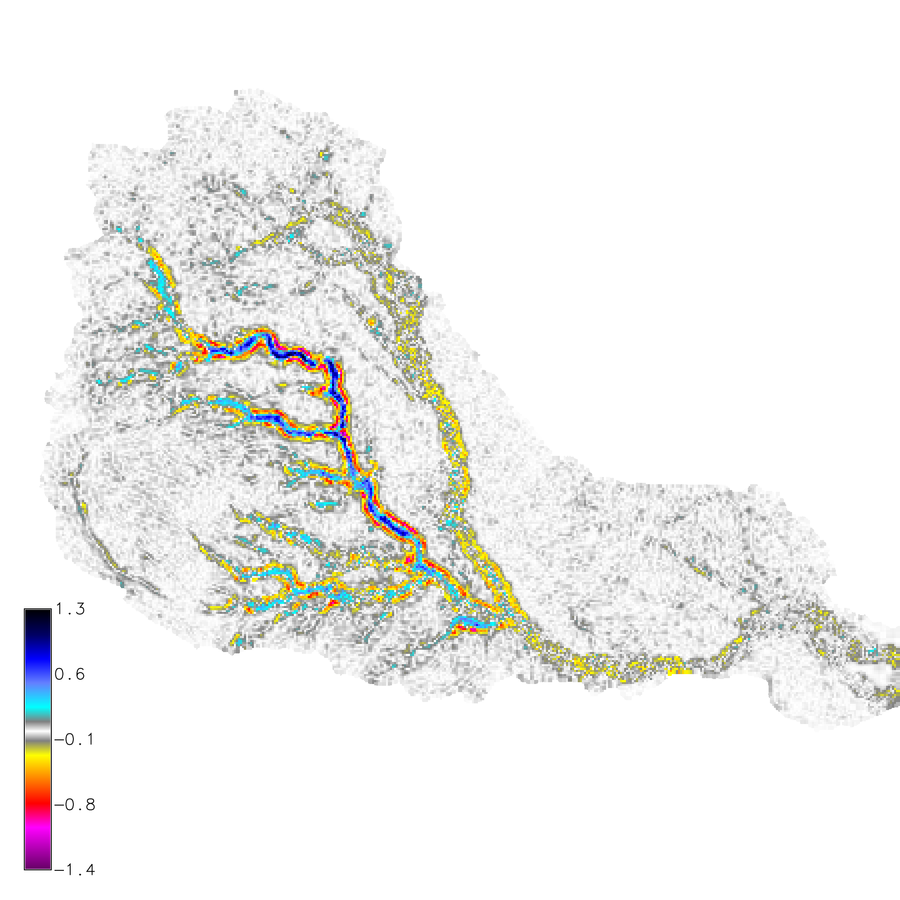
  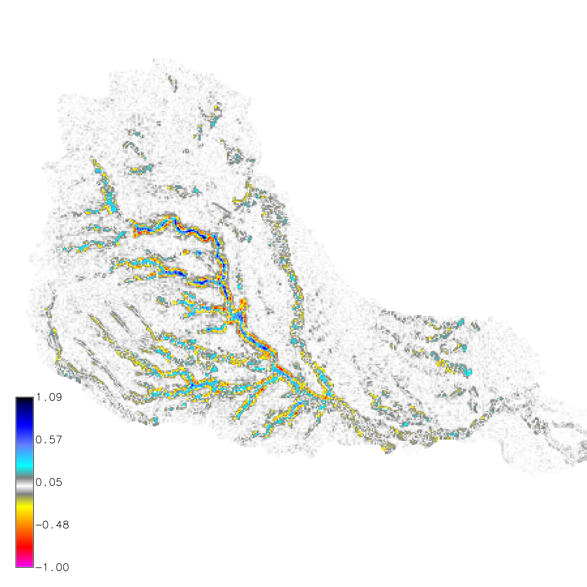
</p>
Net differences (m) for dynamic USPED simulations with
(a) constant versus (b) spatially variable
landcover and soil erodibility factors.
Both were simulated for a 120 min event
with a rainfall intensity of 50 mm/hr
at 3 minute interval at 1 meter resolution.

---

## SIMWE evolution model

Create a new mapset called `simwe` with the module
[g.mapset](https://grass.osgeo.org/grass76/manuals/g.mapset.html).
```
g.mapset -c mapset=simwe location=nc_spm_evolution
```

Set your region to the study area with 1 meter resolution
using the module
[g.region](https://grass.osgeo.org/grass76/manuals/g.region.html).
Copy `elevation_2016` from the `PERMANENT` mapset to the current mapset
using the module
[g.copy](https://grass.osgeo.org/grass76/manuals/g.copy.html).
The input elevation map must be in the current mapset
so that it can be registered in the temporal datasbase.
```
g.region region=region res=1
g.copy raster=elevation_2016@PERMANENT,elevation_2016
```

Run *r.sim.terrain* with the SIMWE model
for a 120 min event with a rainfall intensity of 50 mm/hr.
Optionally use the `-f` flag to fill depressions
in order to reduce the effect of positive feedback loops.
This simulation may take hours to run.
```
r.sim.terrain -f  elevation=elevation_2016 runs=event mode=simwe_mode rain_intensity=50.0 rain_interval=120 rain_duration=120 walkers=1000000 manning=mannings runoff=runoff grav_diffusion=0.05 erdepmin=-0.25 erdepmax=0.25
```

Set the watershed as a mask using the module
[r.mask](https://grass.osgeo.org/grass76/manuals/r.mask.html) and then
display the results with the raster map `net_difference` and a raster legend.
```
r.mask vector=watershed
d.rast map=net_difference
d.legend raster=net_difference range=-2,2
```

<p align="center">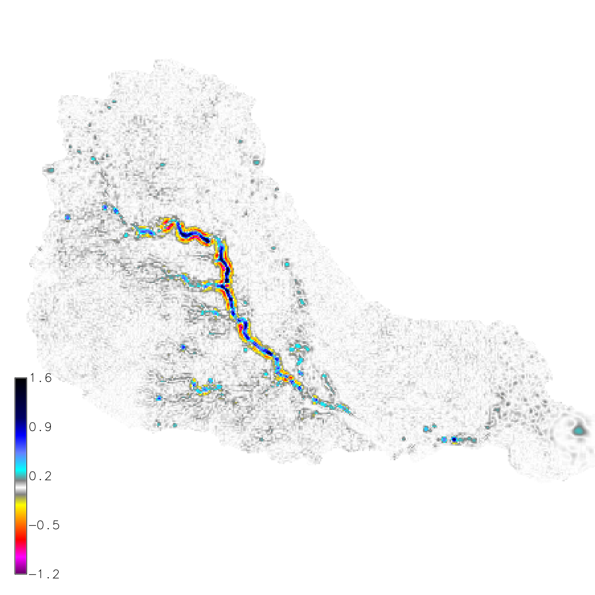</p>
Net difference (m)for a steady state SIMWE simulation
in a variable erosion-deposition regime
of a 120 min event with a rainfall intensity of 50 mm/hr

---

## Parallel processing
In GRASS GIS on Ubuntu turn on
[OpenMP](https://grasswiki.osgeo.org/wiki/OpenMP) support with:

```
./configure --with-openmp
```

Then you use the `threads` flag when running *r.sim.terrain* in SIMWE mode
for parallel processing. In another terminal use `htop` to see CPU usage.
```
r.sim.terrain -f  elevation=elevation_2016 runs=event mode=simwe_mode rain_intensity=50.0 rain_interval=120 rain_duration=120 walkers=1000000 manning=mannings runoff=runoff grav_diffusion=0.05 erdepmin=-0.25 erdepmax=0.25 threads=8
```

## Travel time
For a dynamic landscape evolution simulation the `rain_interval` parameter
should be set to the approximate travel time
for a particle of water to cross the study region. To calculate this
use [r.sim.water](https://grass.osgeo.org/grass76/manuals/r.sim.water.html)
to compute the discharge rate.
Calculate the mean velocity with
[r.info](https://grass.osgeo.org/grass76/manuals/r.info).
```
r.slope.aspect elevation=elevation_2016 dx=dx dy=dy
r.sim.water elevation=elevation_2016 dx=dx dy=dy depth=depth discharge=discharge nwalkers=1000000
r.info map=discharge
```

Then calculate the travel time as a function of mean velocity and distance.
```
travel time = mean velocity (m/s) * distance (m)
184.165 s = 0.36833 m/s * 500 m
```

Alternatively travel time could also be computed using the add-on
[r.stream.distance](https://grass.osgeo.org/grass76/manuals/addons/r.stream.distance.html)
or the add-on
[r.traveltime](https://grass.osgeo.org/grass76/manuals/addons/r.traveltime.html).
